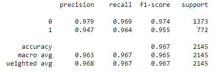
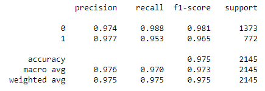
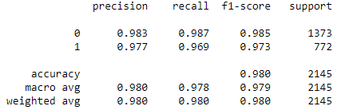
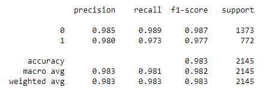
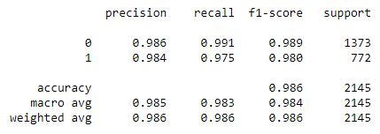

# Epilepsy seizure detection using Wavelet Transform 
Author: Yerkyn Yesbay

## Content
* [Introduction](#intro)
  * [Epileptic seizure](#seizure)
  * [EEG as a diagnostic tool](#eeg)
* [Problem](#problem)
* [Dataset](#data)
* [Data preprocessing and feature extraction](#prep)
  * [Data pre-preprocessing](#clean)
  * [Extracting features from EEG signals using the wavelet transform](#wav)
* [Models used](#model)
  * [SVM](#svm)
  * [Random Forest](#rf)
  * [Logistic Regression](#lr)
  * [CatBoost](#catboost)
  * [LSTM](#lstm)
  * [GRU](#gru)
* [Model performance without wavelets](#performance0)
* [Model performance after wavelets](#performance1)
* [Dependencies](#dependencies)
* [Questions ans suggestions](#questions)


## <a name="intro"></a> Introduction

### <a name="seizure"></a> Epileptic seizure
Epilepsy refers to a collection of neurological disorders that are characterized by recurrent epileptic seizures. These seizures occur due to abnormal electrical activity in the brain and can result in severe convulsions that may lead to self-injury. While most seizures are brief and non-life threatening, prompt recognition of critical seizures is crucial. Early diagnosis has been shown to help control seizures, and patients with epileptic seizures require special treatment and constant monitoring.

Thankfully, epilepsy is a treatable condition, and 70% of cases can be controlled through early diagnosis and medication. Over time, various diagnostic methods have been developed for the early identification of epilepsy. One such method is EEG signal diagnosis. However, visually differentiating EEGs is a complex and costly process. Therefore, this project aims to use machine learning and deep learning methods to quickly and accurately detect epileptic seizures using EEG signals from the brain.

Manual analysis of complex medical data is a time-consuming and error-prone process. Therefore, the development of machine learning enables researchers to propose new approaches to automate and streamline certain aspects of this labor-intensive work.

### <a name="eeg"></a> EEG as a diagnostic tool
EEG remains a key tool in diagnosing and managing patients with seizure disorders, along with a diverse array of other diagnostic methods developed in the past 30 years. This is because it is a convenient and cost-effective way to demonstrate the physiological state of abnormal cortical excitability that underlies epilepsy.

Abnormal electrical activity is frequently observed solely during seizures, while the brain activity is normal otherwise. The lack of an epileptic seizure during an EEG test simply indicates the absence of a seizure during the test, but it does not exclude the possibility of the patient having epilepsy.

Some people with epilepsy may have abnormal brain electrical activity even if they are not currently experiencing seizures. However, some people may have unusual EEG results not related to epilepsy, such as those caused by vision problems or brain injuries. Thus, the presence of unusual patterns of brain waves on an EEG does not always indicate the presence of epilepsy.

However, EEG has certain limitations. The electrical activity recorded by electrodes placed on the scalp or brain surface primarily reflects the summation of excitatory and inhibitory postsynaptic potentials in the apical dendrites of pyramidal neurons in the more superficial layers of the cortex. Quite large cortical areas - several square centimeters - must be activated synchronously to generate a sufficient potential for changes to be registered on electrodes placed on the scalp. The propagation of electrical activity through physiological pathways or through volume conduction in the extracellular space can give a false impression of the location of the electrical activity source. The cortical generators of many normal and abnormal cortical activities recorded on EEG are still largely unknown. Spatial sampling with standard scalp EEG is incomplete, as significant areas of the cortex, particularly in the basal and medial regions of the hemispheres, are not covered by the standard electrode placement. Temporal sampling is also limited, and the relatively short duration of routine EEG recordings in the interictal period is one reason why interictal epileptiform discharges may not be detected in patients with epilepsy during their initial EEG study.

##  <a name="problem"></a> Problem
In this study, our goal is to use EEG signals to classify patients' states and compare the performance of models with and without data preprocessing (wavelet transforms). We are given a dataset

$D = {(x_1,y_1), (x_2,y_2), … , (x_n,y_n)}$

Where $x_i \in X=\mathbb{R}^{178}$ are the observed digital signals and $y_i \in Y=\{1,2,...,K\}$ is the corresponding class label, i.e. indicator of patient's state. The objective of this study is to find a classifier, i.e. a map $f: X \rightarrow Y$ between the feature space X and the class label space Y, that would have the smallest average misclassification on unseen data.

##  <a name="data"></a> Dataset
The dataset used for the study consisted of EEG time series data from the University of Bonn, which had been restructured to contain 5 different target classes, 179 attributes, and 11500 samples. The original dataset contained 5 categories, each with 100 files representing a single subject. Each file recorded brain activity over 23.6 seconds, with the time series divided into 4097 data points representing EEG recordings at different times. Overall, there were 500 individuals in the dataset, each with 4097 data points over 23.5 seconds. The dataset was then divided and shuffled into 23 parts, each containing 178 data points per second, with the last column representing the label $y \in {1,2,3,4,5}$.

The response variable, y, was in column 179 and explanatory variables were X1, X2, ..., X178. The variable y indicated the category of a 178-dimensional input vector, with
- 1 - seizure activity
- 2 - EEG activity was recorded from the area of tumor localization
- 3 - a tumor was present in the brain, but the EEG activity was recorded in the healthy area of the brain
- 4 - eyes closed, meaning that the patient's eyes were closed during the EEG signal recording
- 5 - eyes open, meaning that the patient's eyes were open during the EEG brain signal recording


##  <a name="prep"></a> Data preprocessing
*** ***Implementation of this data preprocessing method can be found in the notebook***

### <a name="clean"></a>  Data pre-preprocessing
The initial steps of preprocessing (therefore called pre-preprocessing) include reducing the target variable into binary and balancing the dataset. First the data target variable was transformed into binary by collapsing the classes ${1,2,3,4,5}$ into ${0,1}$, all non-epileptic cases are assigned the label 0.

After the first step, the number of data points in class 0 was significantly larger. To obtain a more balanced dataset a subsample including all points of class 1 was drawn. Specifically, the class 0 data consisted of 4200 samples and the category 1 data consisted of 2300 samples.


####  <a name="cleanR"></a>  Implementation:
The DataPreprocessing class has three static methods.

- `get_target(self, data)` - This method takes in a Pandas dataframe data as input and returns a tuple containing a modified version of data and the target variable (which is binary, with 1 indicating an EEG seizure and 0 indicating no seizure). The method first converts the target variable to binary by mapping all non-zero values to 1. It then returns the modified data and the target variable.

- `get_balanced_indices` - This method takes in a dataset data and a random state `random_state`, and returns the indices of a balanced subset of the data. It shuffles the indices of the data and then selects the first 6500 indices in descending order of the last column of the data. This is likely used to balance the number of samples in each class of the EEG dataset.

- `plot_balanced_dataset` - This method takes in the original dataset data and the balanced indices, and plots a histogram of the class distribution in the balanced dataset.


```
class DataPreprocessing:
    
    @staticmethod
    def get_balanced_indices(data, random_state):
        np.random.seed(random_state)
        shuffled_indices = np.random.permutation(data.index)
        X = data.loc[shuffled_indices]
        # getting first 6500 values
        return X.sort_values(by=data.shape[1] - 1, ascending=False).iloc[:6500].index

    @staticmethod
    def plot_balanced_dataset(data, balanced_indices):
        plt.hist(data.iloc[balanced_indices][data.columns[-1]])
        
    @staticmethod
    def normalize_data(data):
        scaler = MinMaxScaler()
        scaler.fit(data.drop([data.shape[1] - 1], axis=1))
        return pd.DataFrame(scaler.transform(data.drop([data.shape[1] - 1], axis=1)))
```

###  <a name="wav"></a> Extracting features from EEG signals using the wavelet transform
As EEG signals are complex, nonlinear and nonstationary, frequency-time and nonlinear analysis methods are widely used for detecting epilepsy.

Nonlinear components such as time lag ($TL$), Hurst exponent ($HExp$), and embedding dimension ($ED$) are extracted from EEG and each of its frequency ranges to describe and recognize epileptic seizures. Researchers have previously demonstrated that the use of the Hurst exponent ($HExp$) provides high accuracy in seizure recognition. This value decreases as the delay between two identical pairs of values in the time series increases.

Hurst exponent:

$E[\frac{R(n)}{S(n)}] = C \dot n^{H}, n \rightarrow \infty$

where 
$R(n)$ is the range of accumulated deviations of the first n values from the mean of the series, 
$S(n)$ is the standard deviation, 
$E[x]$ is the expected value, 
$n$ is the time interval, 
$C$ is a constant.

The brain response is generated in the form of wavelets on the surface of the brain. The desired feature is extracted in the form of wavelets, which is called feature extraction. The Hurst exponent is extracted only from these wavelets.

In time series, this parameter is used for the quantitative evaluation of the long-range correlation within the series. It is extracted from the brain surface response, which takes the form of wavelets. Since the EEG signal is non-stationary, the Fourier transform cannot be used as it can only analyze stationary signals. Fourier transform only provides signals that are localized in the frequency domain and does not offer analysis with multiple resolutions. This is where wavelet transform overcomes the limitations of Fourier transform. The varying size of windows used in wavelet transform allows for low and high-frequency resolution data to be obtained separately.


-  $HExp$ < 0.5 indicates that the sequence is anti-correlated and anti-persistent in the long-range
-  $HExp$ > 0.5 indicates long-range correlations in the sequence. The presence or absence of long-range dependence and its degree in a time series can be estimated using $HExp$.
During seizure interruptions, $HExp$ is particularly useful for detecting deviations from the normal pattern of brain activity.


#### <a name="wavR"></a> Implementation:
WaveletFeatures class is used for extracting features from EEG signals using the wavelet transform. Here is a brief description of what each method does:

- `__init__(self)` - The constructor method that initializes the class. It doesn't do anything in this case.

- `calculate_hurst(self, row)` - This method takes a row of data from a Pandas dataframe as input and calculates the Hurst exponent and Hurst coefficient using the compute_Hc function from the hurst library. It returns a Pandas series containing the calculated values.

- `get_hurst(self, data)` - This method takes a Pandas dataframe as input and applies the calculate_hurst method to each row of the dataframe to calculate the Hurst exponent and coefficient. It returns the modified data dataframe with two additional columns (hurst_exp and hurst_c) containing the calculated values.

- `statistics_for_wavelet_transform(self, coefs)` - This method takes a list of wavelet coefficients as input and calculates various statistics (percentiles, mean, standard deviation, variance, and root mean square) on the coefficients. It returns a list containing these statistics.

- `get_wavelet_features(self, data, target)` - This method takes the preprocessed data (with the target variable already converted to binary) and extracts wavelet features from each EEG signal using the wavedec function from the pywt library. It first applies the calculate_hurst method to each row of data to calculate the Hurst exponent and coefficient. It then extracts wavelet features from each signal by iterating over the list of coefficients returned by wavedec and calculating statistics using the `statistics_for_wavelet_transform` method. It returns a Pandas dataframe containing the extracted wavelet features and the target variable.

- `create_df_wavelet(self, data, target)` - This method takes a list of wavelet features (data) and the target variable (target) and returns a Pandas dataframe containing both the features and the target variable. It essentially adds the target variable as an additional column to the list of features.

Overall, the WaveletFeatures class is designed to preprocess EEG data by calculating the Hurst exponent and coefficient and extracting wavelet features from the data using the `pywt` library. These features can then be used as input to a machine learning model for seizure prediction or classification.


```
class WaveletFeatures:
    
    def __init__(self):
        pass
    
    def calculate_hurst(self, row):
        signal = row.iloc[:-1].values
        H, c, data = compute_Hc(signal, kind='change', simplified=True)
        return pd.Series({'hurst_exp': H, 'hurst_c': c})

    def get_hurst(self, data):
        data[['hurst_exp', 'hurst_c']] = data.apply(self.calculate_hurst, axis=1)
        return data
 
    def statistics_for_wavelet_transform(self, coefs):
        percentiles = [5, 25, 50, 75, 95]
        n = len(coefs)
        percentile_values = [np.nanpercentile(coefs, p) for p in percentiles]
        mean = np.nanmean(coefs)
        std = np.nanstd(coefs)
        var = np.nanvar(coefs)
        rms = np.sqrt(np.nanmean(coefs**2))
        return percentile_values + [mean, std, var, rms]

    def get_wavelet_features(self, data, target):
        list_features = []
        for signal in range(len(data)):
            list_coeff = pywt.wavedec(data.iloc[signal], "db4")
            features = []
            features.append(data.iloc[signal]["hurst_exp"])
            features.append(data.iloc[signal]["hurst_c"])
            for coeff in list_coeff:
                features += self.statistics_for_wavelet_transform(coeff)
            list_features.append(features)
        return self.create_df_wavelet(list_features, target)
    
    def create_df_wavelet(self, data, target):
        for i in range(len(data)):
            data[i].append(target[i])
        return pd.DataFrame(data)

```


## <a name="model"></a>  Models used
*** ***Implementation of this models can be found in the notebook***

### 1. <a name="svm"></a>  SVM 
Support Vector Machines is a family of models used for classification and regression tasks, that may very efficiently analyze both linear and nonlinear patterns in the data with an appropriate choice of kernel. The Gaussian RBF kernel is known as a good reproducing kernel that generates a large variety of nonlinear functions. Other kernels might be used for non-linear classification, but the space of functions induced by each kernel, except linear and polynomial,

We use Grid Search Cross Validation to select the optimal regularization parameters C of SVM and the scale parameter of RBF kernel gamma.

### 2. <a name="rf"></a>  Random Forest
Random Forest is an ensemble learning algorithm that aggregates multiple decision trees and outputs the mode of the classes (for classification) or the mean value (for regression) predicted by individual trees. Each decision tree is trained on a random subset of the training data and a random subset of the features in the dataset, which helps to reduce overfitting and increase the model's generalization performance.
For personal convenience we defined the class RandomForestGridSearch, the implementation of which is not important. We use it to tune some of the parameters of a random forest model with the parameter grid defined for the whole class.

### 3. <a name="lr"></a> Logistic Regression
Logistic Regression is a generalized linear model used for classification tasks. It is a simple and popular baseline model in machine learning, which provides similar results to that of SVM with linear kernel but is often easier to fit and allows different regularization penalties such as l1.
The scikit-learn implementation of Logistic Regression allows one to select the inverse regularization parameter C and the l1/(l1+l2) weight ratio.

### 4. <a name="catboost"></a> CatBoost
 CatBoost is a particularly advantageous implementation of gradient boosting on decision trees, a learning algorithm that iterative/additive builds an ensemble of models. Gradient boosting is known to usually outperform other classical (non-deep-learning) machine learning algorithms in accuracy even without hyperparameter tuning, which also makes it computationally attractive compared to e.g. kernel SVM.
 
### 5. <a name="lstm"></a> LSTM network 
 
## <a name="performance0"></a> Models' performance without wavelets

We began with classification in the original feature space, that is without wavelet-based preprocessing. Original signals are inappropriate for linear classification, so we work with nonlinear models, specifically kernel SVM and Random Forest.

SVM with Gaussian RBF kernel showed quite a good result with 97.4% total accuracy and 96.3% precision for class 1 on the test set. A detailed report is below.


With a more thorough search for parameters one can perhaps obtain a slightly better result.

Random Forest has shown a worse results, that is 96.7% total accuracy and 96.3% precision for class 1.




## <a name="performance1"></a> Models' performance after wavelets

After we extracted the wavelet and Hurst features, it turns out that in the new feature space even linear classifiers work remarkably well.

#### Linear classification in the new feature space
A logistic regression model without any parameter tuning showed 97.5% total accuracy and 97.7% precision for class 1.



Linear SVM after after tuning of C has showed 97.8% total accuracy and 97.9% precision for class 1.


#### Nonlinear classification in the new feature space
We also fitted kernel SVM, Random Forest and CatBoost classifier on the new features, obtaining even better results.
Random Forest predicted test data with 98% total accuracy and 97.7% precision for class 1, which is not much better than linear SVM.



SVM with RBF kernel showed 98.3% total accuracy and 98% precision for class 1.



CatBoost classifier showed so far the best classification accuracy, that is 98.6 total accuracy and 98.4% without any parameter tuning.



## <a name="dependencies"></a> Dependencies
#### pandas

```pip install pandas==1.4.1```

#### numpy

```pip install numpy==1.21.5```

#### pywv

```pip install PyWavelets==1.3.1```

#### hurst

```pip install hurst==0.0.6```

#### sklearn

```pip install scikit-learn==1.0.2```

#### matplotlib

```pip install matplotlib==3.5.1```

#### torch

```pip install torch==1.10.1```

#### seaborn

```pip install seaborn==0.11.2```

#### catboost

```pip install catboost==1.1.1```

## <a name="questions"></a> Questions and suggestions
If you have any questions or suggestions, write to the email: yesbay185@gmail.com
